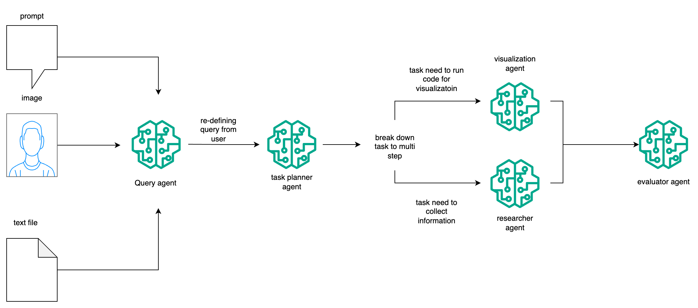

# Deep Research Agent

This project implements a multimodal Deep Research Agent capable of handling user queries with text, image, or file inputs, conducting deep web research, generating visual outputs, and compiling comprehensive reports. The solution is designed with a modular architecture, leveraging FastAPI for the backend, LangChain for the agentic research pipeline, and Streamlit for an interactive user interface.

## Architecture


## Workflow



## Features

- **Input Handling**: Accepts text prompts, image URLs, and file uploads (PDF, DOCX, CSV).
- **Agentic Research Pipeline**: Utilizes a LangChain-based agent to:
    - Analyze and interpret user queries.
    - Perform web search and extract relevant data.
    - Synthesize information from multiple sources.
    - Generate and embed necessary supporting visuals (placeholder).
    - Provide structured findings with source attribution.
    - Evaluate report completeness, clarity, and relevance.
- **Output Generation**: Produces a well-structured Research Report (PDF and Markdown) and a concise Thinking Process Summary.
- **FastAPI Backend**: Exposes `/query` and `/status` endpoints, with an optional WebSocket for live feedback.
- **Streamlit Demo UI**: Provides an interactive web interface for input submission, streamed answers, visualization previews, and report downloads.

## Setup Instructions

### Prerequisites

- Python 3.9+
- pip

### Backend Setup

1. Navigate to the `backend` directory:
   ```bash
   cd deep_research_agent/backend
   ```
2. Install dependencies:
   ```bash
   pip install -r requirements.txt
   ```
3. Set your OpenAI API key as an environment variable:
   ```bash
   export OPENAI_API_KEY="YOUR_OPENAI_API_KEY"
   ```
4. Run the FastAPI application:
   ```bash
   uvicorn main:app --host 0.0.0.0 --port 8000
   ```
   The API will be accessible at `http://localhost:8000`.

### Streamlit UI Setup

1. Navigate to the `streamlit_app` directory:
   ```bash
   cd deep_research_agent/streamlit_app
   ```
2. Run the Streamlit application:
   ```bash
   streamlit run app.py
   ```
   The Streamlit app will open in your browser, typically at `http://localhost:8501`.

## API Documentation

The FastAPI application automatically generates interactive API documentation using Swagger UI. Once the backend is running, you can access it at `http://localhost:8000/docs`.

### Endpoints

- `GET /status`:
    - **Description**: Returns the health status of the API.
    - **Response**: `{"status": "ok", "message": "Deep Research Agent API is running."}`

- `POST /query`:
    - **Description**: Receives user input and initiates the deep research process.
    - **Request Body Example**:
      ```json
      {
        "text_query": "Compare the pros and cons of using Kubernetes vs Docker Swarm for container orchestration."
      }
      ```
      ```json
      {
        "image_url": "https://example.com/diagram.png"
      }
      ```
      ```json
      {
        "file_url": "/path/to/document.pdf"
      }
      ```
    - **Response Body Example**:
      ```json
      {
        "executive_summary": "Research completed based on your query.",
        "key_findings": [
          "Placeholder finding."
        ],
        "visuals": [],
        "conclusion": "Further detailed analysis is required for a comprehensive report.",
        "references": [
          "Source: Agent's internal knowledge."
        ],
        "thinking_process": "No detailed thinking process available.",
        "report_paths": {
          "pdf": "./output_report.pdf",
          "markdown": "./output_report.md",
          "thinking_process": "./thinking_process.md"
        }
      }
      ```

## Sample Inputs/Outputs

### Sample Input (Text)

"Explain the concept of attention in deep learning and its significance in Transformer models."

### Sample Output (Conceptual)

**Executive Summary**: This report provides an overview of the attention mechanism in deep learning, highlighting its role and significance within Transformer architectures.

**Key Findings**:
- Attention allows models to weigh the importance of different parts of the input sequence when making predictions.
- Self-attention in Transformers enables parallel processing and captures long-range dependencies effectively.

**Conclusion**: Attention mechanisms have revolutionized sequence modeling, particularly with the advent of Transformer models, by improving the ability to handle complex relationships in data.

**References**: [Conceptual sources would be listed here]

**Thinking Process Summary**: The agent identified key terms, performed web searches on "attention mechanism" and "Transformer models," synthesized information from various articles, and structured the findings into the report format.

## Future Enhancements

- Full implementation of image and file input processing (OCR, document parsing).
- Integration with real web search APIs (e.g., Google Custom Search, Brave Search).
- Advanced visual generation capabilities (e.g., dynamic chart creation).
- Robust error handling and logging.
- Deployment to a cloud platform (e.g., Streamlit Cloud, AWS, GCP).


